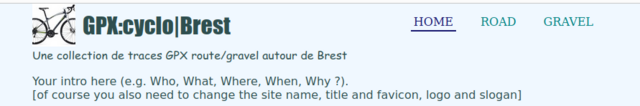
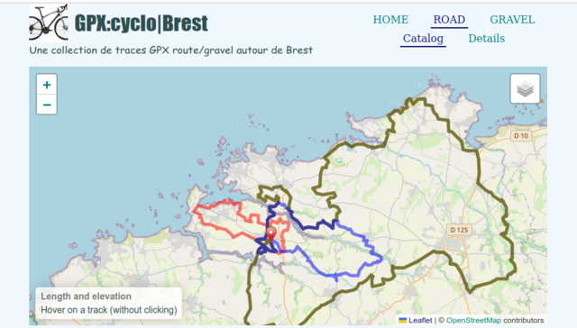

# gpxCatalog

A website template based on [Leaflet](http://www.leafletjs.com), [leaftlet-gpx](https://github.com/mpetazzoni/leaflet-gpx) and [leaflet-evelevation](https://github.com/Raruto/leaflet-elevation).

This template allows one to publish a catalog of gpx tracks.

<p align="center">
  
  
</p>

There is actualy a single HTML page, the content of which is JavaScript-modified by buttons in top-right menus. Thus the menus are not lists of links as usual.

The two categories of the primary menu are hard-coded but it should be easy to modify/add/remove items by hand.

You can view an instance of `gpxCatalog` there: 
[GPX:cyclo|Brest](https://www.lherminet.infini.fr/cyclo/).

## License

`gpxCatalog` is provided under the *GPLv3*. Which is kind of pedantic because anyone can get the source anyway using `Ctrl-U` when visiting the instance above, since it is made only of HTML, CSS and JavaScript.

## Installation

The site needs to be http-served. You can't view it by just opening `index.html` from your file system with your browser (`Ctrl-O` will raises CORS issues).

## User interface

Clicking on ROAD or GRAVEL (categories to be modified at your will, see above) will bring up a secondary menu and, by default, a map with the tracks available in the chosen category. The secondary menu offers two choices: Catalog (default) and Details.

The main map (Catalog) contains a cartridge (bottom left) that updates with the name, distance and elevation of the track on which the mouse hovers. Different backgrounds are available in the selector at the top right.

To obtain a detailed map, you can (i) click on a track in the main map or (ii) click on Details and choose a track from the drop-down list. The detailed map offers an altitude profile (below the map) that animates a mobile on the map when you fly over it. **Smartphone:** The profile of the detailed map is (purposedly) not displayed, nor the cartridge of the main map.

## How to update the catalog

* Edit the JSON in `js/files.js`, which is rather self-explanatory, e.g.:
```
const roadTracks = [
  {
    label: "TBLC24-135km",
    path: "road/tblc24-cyclo-135km.gpx",
    description: "Tro Bro Leon Challenge 2024: 135km."
  },
  {
    label: "TBLC24-105km",
    path: "road/tblc24-cyclo-105km.gpx",
    description: "Tro Bro Leon Challenge 2024: 105km."
  },
  {
    label: "TBLC24-35km",
    path: "road/tblc24-cyclo-35km.gpx",
    description: "Tro Bro Leon Challenge 2024: 35km."
  }
]
```
* Copy (`cp` or `ftp`) the gpx files and the JSON to your (local or remote) server, in the relevant directories.

The site will then automatically take your new data into account.

## Caveats

* Switching too fast in the menus might get the maps confused... in such a case one needs to reload the page (`Ctrl-R`).
